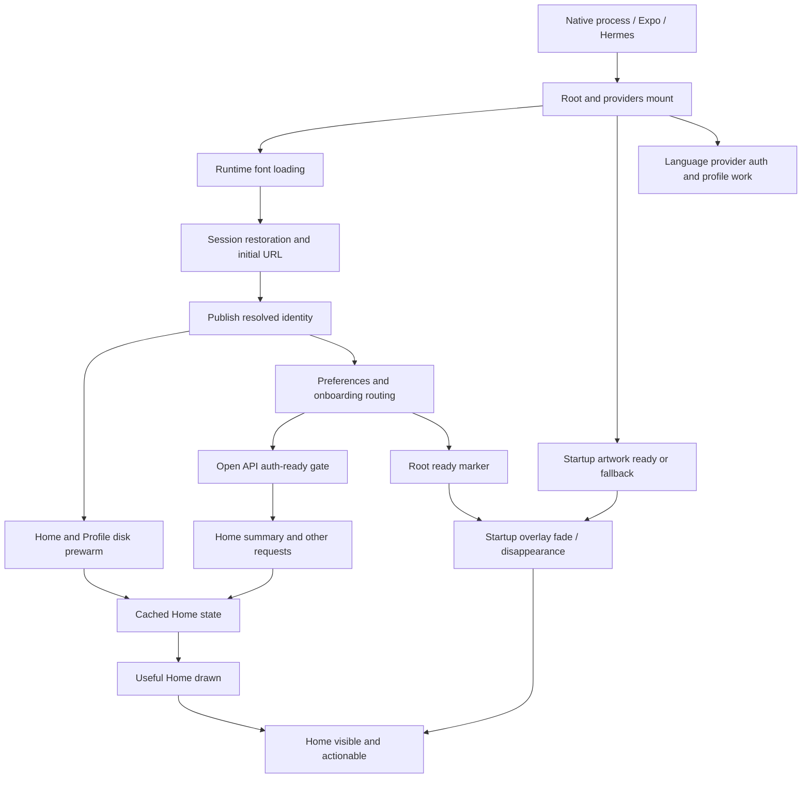

# Shoonaya performance: code audit, industry research and execution plan

Research date: 20 September 2026. Status: proposal; no application changes made for this review.

## Decision

Keep the existing cache-first architecture. First make measurement trustworthy and remove startup dependency mistakes; then reduce unnecessary work; finally tune native builds and module loading against measured traces. Do not start a cache-framework replacement, framework migration, or large endpoint rewrite from the earlier numerical score.

The implementation has useful foundations, but current evidence does not establish its real-device launch latency, rendering smoothness, energy use, or parity with a large consumer app. Some previous “all phases complete” claims describe code delivery rather than the measurement gate required by the startup plan.

## Scope and evidence limits

Native repository: `/Users/Business(C)/shoonaya-mobile`. Backend/PWA and canonical API/DTO ownership: `/Users/Business(C)/Sanatan Sangam/Shoonaya`.

Inspected startup orchestration, font/splash handling, providers, identity/session/API layers, Home coordinator and child cards, Home/Profile/Japa/Mandali/Pathshala cache implementations, all tab loaders, realtime/outbox lifecycle, telemetry recording/upload/admin aggregation, Home and Profile server routes, Metro/native release configuration and relevant tests. Searched other routes for repeated auth and heavy imports. This is an end-to-end static review of the performance architecture, not line-by-line certification of every feature or production query plan.

Both repositories had existing edits and concurrent activity during review, including telemetry additions being committed. Findings describe the inspected working-tree implementations; implementation must recheck the referenced symbols against the next frozen baseline. No production database, deployment, EAS build, phone benchmark, or store-console measurement was performed. Existing APKs are older artifacts, not proof of the reviewed source's performance.

Native validation performed with the repository's existing commands:

- `npm run typecheck`: passed, no TypeScript errors.
- `npm test`: 648 passed, 0 failed, 0 skipped, 0 cancelled; 115 suites (20 September 2026; stale as of 21 September, see below).
- These tests establish limited functional/structural properties, not launch speed. In particular, the auth-ownership test examines selected screen files and misses providers/components.
- **Update 2026-09-21.** Suite has grown to 703 tests / 125 suites since the above count. An external review run on 2026-09-21 reported `702 passed, 1 failed` -- a date-dependent failure in `__tests__/home-prewarm-and-snapshot.test.ts` (a Home snapshot stored under a mocked 2026-09-20 clock, then read back against a real, unmocked "now"), diagnosed as passing in isolation under a frozen clock (7/7) but not the full run. Re-run independently three times against current source, same command (`npm test`): all three reported `703 passed, 0 failed, 0 skipped, 0 cancelled`. The failure did not reproduce here. Given the test's own line 201 passes an explicit `new Date('2026-09-21T12:00:00.000Z')` rather than reading the real clock, the most likely explanation is that the reviewer's run happened before the environment's real date rolled over to 2026-09-21 (a genuinely date-sensitive fixture, just not necessarily via the mechanism assumed) -- not a fix landing in between. This is recorded rather than resolved either way: the fixture's dependence on real wall-clock date proximity is itself the defect worth closing (freeze/inject time fully, per the review's own recommendation), regardless of which specific run happened to pass.

Graph reports were consulted as required. The native graph contains substantial Pods/header noise and is dated before current changes; direct source inspection is authoritative here. Refresh the source-scoped graph as part of subsequent code delivery.

## Lessons from real large apps

| Primary engineering source | Published lesson | Application to Shoonaya |
|---|---|---|
| [Shopify App performance, 2024](https://shopify.engineering/improving-shopify-app-s-performance) | Set percentile goals; inspect cache-hit rates, viewport rendering, module initialization and hidden-screen work. | Measure the visible Home experience and child requests before adding caches. Profile a bounded first viewport and deferred cards. Their gains are not our estimates. |
| [Shopify render measurement, 2022](https://shopify.engineering/measuring-react-native-rendering-times) | A React render is not proof that native UI is visible and interactive; distinguish render passes and transitions. | Mark data-ready, visible-content and interaction separately. Validate markers using native traces and UI actions. |
| [Uber iOS measurement, 2022](https://www.uber.com/sa/en/blog/measuring-performance-for-ios-apps-at-uber-scale/) | iOS process prewarming distorted custom launch timings; combine OS measurements with carefully defined application spans. | Do not treat time since JS/root mount as tap-to-content. Separate OS launch metrics from custom spans; keep OS/device cohorts. |
| [Meta Baseline Profiles, 2025](https://engineering.fb.com/2025/10/01/android/accelerating-our-android-apps-with-baseline-profiles/) | Tune profiles to actual journeys and check memory tradeoffs; larger profiles can regress performance. | Benchmark app-specific Android startup/feed paths after checking existing dependency profiles. Avoid profiling the entire app indiscriminately. |
| [Facebook Android, 2014](https://engineering.fb.com/2014/06/19/android/improving-facebook-on-android/) | Low-end-device traces exposed too many concurrent initializations. | Background work still competes for CPU, disk and network. Schedule it by user need, not merely with `void` promises. |

Research currency matters: [Shopify's September 2026 Shop app migration](https://shopify.engineering/shop-app-migration) describes moving that app to native implementations and comparing visible home-feed startup. That is a distinct product and workload from the 2024 Shopify App study. It neither invalidates the earlier measurement lessons nor proves Shoonaya needs a rewrite. Investigate a native replacement only if measured bottlenecks survive targeted fixes and justify its cost.

## Actual startup dependency path

Some branches overlap; the diagram is dependencies, not measured duration. Child screens can mount under the overlay. The API gate is an additional dependency even when cached rendering is available.

## Findings and proposed remedies

“Confirmed” means the source path exists. It does not quantify device impact. “Experiment” means benefit remains to be demonstrated.

| ID / priority | Evidence and consequence | Proposed work and proof |
|---|---|---|
| F01 / P0 measurement | `app/_layout.tsx` calls `markInteractive()` when `readyToRender` becomes true. The artwork overlay may still be fading and Home may still be loading. The local receipt starts at root mount. | Separate root-ready from real interaction. Require the destination's usable content and overlay removal; validate against native trace/video and a successful tap. Classify emergency fallback separately. |
| F02 / P0 startup dependency | Cold start awaits `routeForSession`; missing-profile repair inside it uses `apiFetch`; that function awaits `waitForAuthReady`; the normal `markAuthReady` occurs after routing returns. The emergency timer opens the gate after six seconds. | Separate session-resolution readiness from route/profile readiness. Permit authenticated bootstrap after token resolution without bypassing authorization. Test missing profile, failed profile lookup, expired session and OAuth. Repair must not depend on the emergency timer. |
| F03 / P1 identity ownership | `lib/i18n/LanguageContext.tsx` calls `getUser`, reads `profiles.app_language`, and registers another auth listener. `components/home/SacredCalendarSheet.tsx` also registers a listener. The ownership test scans selected tab files only. | Consume centralized identity, deduplicate language reconciliation, invalidate late responses on identity/language revisions, preserve explicit language changes and remote reconciliation. Widen ownership coverage with an explicit allowlist for intentional auth infrastructure. |
| F04 / P1 serial startup work | Root's session-restore effect returns until runtime fonts load. `app.json` registers the font plugin without an explicit embedded font list; root loads several families/weights with `useFonts`. | First test font-independent auth initialization while keeping rendering font-safe. Separately test build-time font embedding with verified native family names and all supported scripts. Measure font and identity spans independently. |
| F05 / P1 misleading telemetry | Home's memory-snapshot fast path can return from `onFocus` without recording a route-open; other routes record when data is applied, before native paint. Profile has server-timing collection but no equivalent route-open instrumentation. | One route-flow owner per navigation. Record memory/disk/network/empty/error outcomes consistently. Capture initial and repeat tab visits, successful empty states, abandoned loads and failures. Do not make fastest opens disappear from the dataset. |
| F06 / P1 telemetry identity | `telemetryUpload.ts` reads an identity's summary asynchronously, then calls `apiFetch` without binding `expectedUserId`. Switching accounts during that sequence can attach the old summary to the new token. | Capture identity revision, cancel superseded uploads and bind authenticated requests to their owner. Define explicit guest behavior. Test A→B and A→logout→A, including delayed reads and 401 replay. |
| F07 / P1 telemetry aggregation | Uploads contain overlapping rolling summaries and app version/platform, without native build/OTA update ID, launch type, sample-window identity, or device/OS cohorts. Upload is background-triggered. Backend time-window counts are computed from a latest-row limit. | Add non-overlapping windows, idempotent batch IDs, build/OTA/metric-schema identity and bounded cohorts. Compute window counts across the actual time range. Use mergeable histograms or sampled observations; never average device p95s into a fleet p95. Background delivery is best effort: retry safely on a later active session and count unreported/abandoned flows. |
| F08 / P1 telemetry overhead | Each append reads/parses/writes the rolling AsyncStorage envelope. Clearing telemetry does not coordinate pending append chains. | Measure serialization/storage cost; batch bounded events after useful content or at safe lifecycle opportunities. Add clear-generation barriers so queued writes cannot restore cleared data. Preserve crash/stall evidence with a small receipt, not a full-buffer write per milestone. |
| F09 / P1 Home work outside summary | `index.tsx` uses a long ScrollView. `QuizSparkCard` starts quiz/stats/saved-response work and conditionally session/profile reads; `FestivalQuizBanner` fetches separately. Home-live, push/location/timezone and language reconciliation add work. | Inventory every request and mount before useful Home and before interaction. Defer below-viewport cards based on visibility/intent, retain stable placeholders, and avoid repeated mounts. Consider section virtualization only if traces justify it. One Home-summary request is not the total app request count. |
| F10 / P1 Profile waterfall | `profile.tsx:loadProfile` awaits progress summary, then a direct `profiles`/`kuls` lookup before constructing the final profile. Backend progress-summary owns the main DTO. | Either include the safe kul display fields in the canonical summary or paint the main profile before optional enrichment. Preserve live-only entitlement authority. Test offline/cache-hit/missing-kul behavior; eliminate the extra request or remove it from useful-content latency. |
| F11 / P1 lifecycle work | Mandali realtime subscription and seekers/connection-request effects are tied to mounted/profile state, not focus. Visited tabs may remain mounted. Generation guards stop stale UI application but do not necessarily stop requests. | Define offscreen policy: retain data; pause nonessential subscriptions/queries; mark dirty and refresh once on return. Keep durable outboxes reliable. Compare hidden-tab network, renders, CPU and return freshness. |
| F12 / P1 failure amplification | Mandali feed failure starts a direct-Supabase fallback with additional reads. Safety lookup failure currently substitutes empty exclusion sets. `resilientFetch` retries transient failures without method/idempotency classification. | Bound degraded-mode work. Prefer safe existing content/explicit failure where eligibility cannot be established. Retry reads within a deadline; retry mutations only with an idempotency guarantee. Measure attempts and failures, not only eventual success time. |
| F13 / P1 request deadlines | `apiFetch` starts its deadline after waiting for auth. Passing a caller signal disables its internally created deadline. It returns after headers, so subsequent body parsing is outside that timer. | Specify auth-wait, transport/body and total-user-flow budgets. Compose caller cancellation with deadlines and distinguish timeout/cancel/unauthorized. Do not claim that `timeoutMs` currently bounds the entire flow. Check refresh deduplication at both app and Supabase SDK layers before adding another refresh owner. |
| F14 / P1 cache consistency | Home/Profile have stronger memory/read deduplication and clear barriers. Mandali/Pathshala use simpler read/write/remove storage; Japa uses one storage slot with an owner check and clears on the guest Japa path. | Audit every sign-out/account-switch boundary, including a tab never mounted and a write racing removal. Preserve the Japa owner check; add explicit purge/lifecycle guarantees where missing. Adopt small shared invariants, not a wholesale cache replacement. Recheck language/tradition/location/content-version invalidation independently of user ID. |
| F15 / P2 tab request policy | Pathshala refreshes paths and context together on loads/focus. Bhakti has a local in-flight/TTL helper. Japa intentionally reconciles durable completion work after context loading. | Use per-surface invalidation/freshness rules, shared in-flight work where demonstrated, and separate static catalog version from private progress. Keep completion reconciliation, membership changes and manual refresh authoritative. Measure tab return requests, stale duration and network bytes. |
| F16 / P2 Tirtha location | `initialize` waits for both passport and a location chain using current GPS followed by nearby results. No current-position deadline is visible in this path. | Display the passport independently. Test an age/accuracy-qualified last-known location while requesting current position, with truthful location labeling and bounded waits. This must not supply approximate location to canonical calendar calculations. |
| F17 / P2 backend critical path | Home-summary performs auth/profile work, parallel data batches, then calendar batch metadata and published story enrichment before responding. A client request still fans out into many server queries. Timeout races provide fallbacks but do not inherently cancel underlying work. | Use existing Server-Timing and correlated traces to rank stages. Record DB/query counts, payload bytes and degraded sections. Only then split optional enrichment, improve selective queries or introduce qualified caching. Preserve every calendar eligibility/approval check. Index work requires query plans on representative safe data. |
| F18 / P2 JS initialization | Installed Expo Metro defaults contain `inlineRequires: false`; local config does not override it. Maps and YouTube are statically imported in their destination routes. Inclusion in a bundle does not prove startup evaluation. | Trace evaluated modules and native module initialization. Test inline requires independently, with side-effect-order tests. Defer expensive feature initialization only when it is on the launch path. Do not advertise native production route splitting as available. |
| F19 / P2 Android build | Release minification/resource shrinking default off; keep rules broadly preserve Expo/React/Reanimated classes. | Build a release experiment with code/resource optimization configured in both the source-of-truth prebuild config and actual native build path. Refine rules conservatively; retain mapping files and verify symbolication. Measure device-specific delivered size and startup, not universal APK size alone. |
| F20 / P2 native profiles/assets | Existing local release output contains baseline-profile artifacts, but their presence does not prove app-specific journey coverage. Startup artwork and Home hero decoding are separate from disk JSON hydration. | Inspect packaged profile contents/installation; benchmark compilation modes before generating app-specific profiles. Trace image decode, dimensions, memory and repeated tab-switch retention. Keep offline artwork and supported devices. |
| F21 / P1 test blind spots | Current tests can pass despite F02/F03 because isolated gate tests and source-pattern assertions do not execute the complete provider/startup interaction. | Add integration tests of the actual orchestration and rendered transitions, plus release-build end-to-end journeys. A regression test should fail on the old behavior and cover negative/cancellation branches. |

F02 is a code-level wait-cycle finding with a timed escape, not a claim that all users encounter a six-second launch. F11/F18/F20 need profiling to establish cost. F12's safety fallback needs correctness review even if its performance cost is small.

## Resolution log

Status per item, not a general execution record. Entries here are removed from
the open backlog only to the extent stated; partial fixes stay partial until
their remaining scope is separately closed.

- **F06 -- resolved and regression-tested (2026-09-20).** `telemetryUpload.ts`
  now captures an identity lease via `lib/appIdentity.ts`'s
  `captureAppIdentity()` before the AsyncStorage/`getTelemetrySummary` awaits,
  and the pure decision (`lib/telemetryUploadPolicy.ts`'s
  `decideTelemetryUploadAfterSummary`) refuses to send when that lease is no
  longer current -- the same revision-counter mechanism `app/(tabs)/profile.tsx`
  already uses, which expires on any identity transition including A → B → A,
  not just "is the user id still equal." `expectedUserId` is also passed on the
  request itself so `apiFetch` re-verifies the live session at the actual send
  moment. Regression coverage added in
  `__tests__/telemetryUploadPolicy.test.ts` (11 cases): account switch (A→B),
  sign-out (A→logout), the reverse direction (guest→authenticated), the A→B→A
  non-revival case, unchanged-identity sends with correct `expectedUserId`
  presence/absence, empty-summary skip, and throttle/delayed-upload timing
  (before-window, exact-boundary, multi-day-delayed, no-prior-timestamp,
  corrupt-timestamp-fails-safe). `401 replay` specifically (the request
  succeeding on retry after a token refresh mid-flight) is not separately
  covered -- `apiFetch`'s own refresh-and-retry path is exercised elsewhere,
  not by this feature's tests. Native commits `4840142`, plus policy
  extraction/tests (pending commit as of this entry).
  **Update 2026-09-21, external review**: correctly found the guest send
  path still had no send-time owner check at all -- `expectedUserId` only
  ever gets attached for the authenticated branch, so a guest upload had
  nothing closing the gap between `decideTelemetryUploadAfterSummary`'s
  `isCurrent()` check and `apiFetch`'s own internal awaits
  (`waitForAuthReady`, token resolution). A sign-in landing in that window
  would have let `apiFetch` attach the newly-authenticated session's Bearer
  token to a request whose body still carried the guest's summary. Fixed
  by adding a symmetric `expectedGuest` option to `apiFetch`
  (`lib/api.ts`) -- asserts no session exists at the actual send moment,
  mirroring `expectedUserId`'s existing mechanism exactly, and throws the
  same way on mismatch. `decideTelemetryUploadAfterSummary`'s guest branch
  now returns `{action: 'send', expectedGuest: true}` instead of a bare
  `{action: 'send'}`. Regression: updated
  `__tests__/telemetryUploadPolicy.test.ts` for the new return shape, plus
  source-regression checks confirming the mechanism exists in both
  `lib/api.ts` and `lib/telemetryUpload.ts` (direct behavioral testing of
  `apiFetch` itself isn't done anywhere in this codebase, guest or
  authenticated -- it imports the real Supabase client -- matching the
  existing convention that only the decision/policy layer above it is
  unit tested).
- **F07 -- partially resolved (2026-09-20).** Fixed: backend time-window counts
  (`submissions_1h`, `submissions_24h`, `distinct_authenticated_users_24h`)
  now come from real range-scoped `count: exact` queries against the full
  table instead of being derived from the capped 100-row `recent` list, which
  silently under-reported once daily submissions exceeded 100 rows. Backend
  commit `1a8a80d`. **Still open, not attempted:** native build number/OTA
  update ID/launch-type/sample-window identity are not in the upload payload;
  uploads remain overlapping rolling summaries (each snapshot re-reads up to
  the same 500-event rolling buffer, not a non-overlapping window); there is
  no idempotent batch ID; the admin view still lists individual per-device
  summaries rather than mergeable histograms, and does not average or present
  a cross-device p95. These require a payload/schema change (native + backend
  contract) and are deliberately deferred to a separate, explicitly-scoped
  pass -- not bundled into this fix.
  **Update 2026-09-21, external review**: correctly found two remaining
  gaps in the fix above. (1) `distinct_authenticated_users_24h` was still
  computed by fetching up to `DISTINCT_USERS_SCAN_LIMIT` (5000) raw
  `user_id` rows and deduplicating client-side -- correct at current
  volume, but silently under-reports once authenticated submissions in the
  24h window exceed that cap, with the same "no signal that truncation
  happened" character as the original bug. (2) none of the four
  `Promise.all` results checked `.error` before defaulting via `?? 0` --
  a failed count query became indistinguishable from a genuine "zero
  submissions" period. Fixed: (1) new migration
  `20260921015101_count_distinct_native_telemetry_users.sql` adds a real
  `count_distinct_native_telemetry_users(p_since)` SQL function
  (`security invoker`, service-role-only execute grant, matching this
  table's own RLS convention) doing an actual `COUNT(DISTINCT user_id)` in
  Postgres with no row cap; the aggregator now calls it via `.rpc(...)`
  instead of dereferencing rows client-side. (2) every count field
  (`submissions_1h/24h/lifetime`, `distinct_authenticated_users_24h`) is
  now `number | null`, with `null` meaning "the query failed, value
  unknown" -- distinct from a genuine 0 -- and the admin UI
  (`NativeStartupTelemetrySection.tsx`) renders `null` as "Unavailable" in
  rose-colored text rather than silently showing 0. A separate
  `recent_fetch_error` boolean surfaces a failure of the per-submission
  list independently of the counts (which are fetched separately and can
  succeed even if the list fetch fails, or vice versa). Not applied to
  production yet -- this migration needs to be applied before the RPC call
  will resolve instead of erroring (which the new error-honesty change
  would at least now report correctly as "Unavailable" rather than a
  silent 0). This backend repo has no `npm test` script (confirmed
  unchanged from earlier in this session); verification here is
  `npx tsc --noEmit` (clean) plus direct code review, not an automated
  regression test.
- **F01 -- partially resolved (2026-09-20; relabeled from "resolved" on
  2026-09-21 per external review -- the original label overstated this).**
  `markInteractive()` now gates on
  `resolveStartupSurface({readyToRender, showStartupScene}) === 'app'`
  (`lib/startup-visibility.ts`, already tested) instead of bare
  `readyToRender`, closing the gap where the startup overlay could still be
  crossfading out when the `tti` metric fired. The 6-second emergency
  fallback path now tags `viaEmergencyFallback` on both the Observe metric
  and the local startup receipt, so forced readiness is distinguishable
  from normal readiness. **Not attempted, and the reason this stays
  partial:** waiting for the destination screen's own content (e.g. Home's
  cache hydration) to report itself ready -- that needs a cross-component
  readiness signal this pass does not add; `markInteractive` still fires
  once the overlay is gone and root/auth state is resolved, even if Home
  underneath is still loading. Native commit `9d50798` (source-regression
  test included, confirmed failing against the pre-fix source before the
  fix was applied).
- **F02 -- reproduced and fixed (2026-09-20).** Confirmed by direct source
  trace, not just accepted from the finding: cold start's `prepare()`
  awaited `routeForSession(session)` to completion before calling
  `markAuthReady()`; `routeForSession`'s missing-profile repair path (a
  real, reachable OAuth-trigger-failure recovery case, not hypothetical)
  calls `apiFetch('/api/native/profile/bootstrap', ...)` internally, and
  `apiFetch` awaits `waitForAuthReady()` before firing any request --
  which cannot resolve until `markAuthReady()` runs, the very call
  `routeForSession`'s completion was gating. A genuine deadlock, broken
  only by the 6-second emergency fallback, for exactly the accounts the
  repair path exists to help. Reproduced in
  `__tests__/coldStartAuthGateOrdering.test.ts` using `lib/authReadyGate.ts`'s
  real exported functions (not a hand-rolled fake) to mirror the exact
  control-flow shape read out of `app/_layout.tsx`; confirmed the
  reproduction actually deadlocks before writing the fix. Fixed by moving
  `markAuthReady()` to fire immediately after the session token is known
  (right after `setApiAccessTokenFromSession`), decoupled from
  `routeForSession`'s completion -- matching `waitForAuthReady`'s own
  documented contract ("the session is known," not "routing has also
  finished"). `setAuthReady(true)` (visual overlay-hide gating) deliberately
  stays positioned after `routeForSession`, per the proposed remedy's
  "separate session-resolution readiness from route/profile readiness" --
  the user should still not see a screen flash before routing decisions
  (onboarding vs. Home vs. login) are made. Native commit (pending as of
  this entry). **Not addressed:** the doc's fuller ask ("test missing
  profile, failed profile lookup, expired session and OAuth") is only
  partially covered -- the reproduction test exercises the missing-profile
  deadlock shape specifically, not the other three scenarios, and none of
  the four have been exercised as real device-level integration tests
  (not possible under this project's plain `tsx --test` runner without a
  React Native test renderer, which does not exist in this repo yet).
- **F03 -- resolved (2026-09-20).** Confirmed both named files still had
  their own independent auth ownership, unrelated to the earlier language-
  architecture-unification pass this session did (that fixed reader/
  global-scope conflation, a different bug). `lib/i18n/LanguageContext.tsx`
  ran a one-shot user lookup on mount plus its own dedicated auth-state
  subscription, with two real bugs beyond duplication: the subscription had
  no generation guard (a slow profile read from an earlier identity could
  resolve after a newer one and overwrite it), and it did nothing at all on
  sign-out, leaving a just-signed-out user's `app_language` visible to
  whoever used the device next. `components/home/SacredCalendarSheet.tsx`
  ran a second, independent auth-state subscription purely to close itself
  on an account switch -- a legitimate purpose, but no reason it needed its
  own subscription to do it. Both now consume `useAppIdentity()`
  (`lib/appIdentity.ts`); `LanguageContext` additionally uses
  `captureAppIdentity()`'s lease to guard the async profile reconciliation
  against the exact race described above, and falls back to the device
  cache (not a hardcoded default) on sign-out/guest so an explicitly-set
  guest language survives. Widened `__tests__/app-identity-ownership.test.ts`
  (previously scanned only the tab screens) to cover both files, plus a
  dedicated assertion in `__tests__/language-context.test.ts` -- confirmed
  both fail against the pre-fix source before the fix was applied. **Not
  attempted:** full identity-scoped language storage (separate cache keys
  per user/guest, matching how Home/Profile/Mandali caches are scoped) --
  `APP_LANGUAGE_STORAGE_KEY` remains one device-wide key, so a second
  account signing in immediately after a first can still see a brief flash
  of the first account's language until its own reconciliation resolves.
  That is a larger, explicitly out-of-scope change for this pass, not a
  silently dropped fix.
- **F05 -- resolved (2026-09-20).** Confirmed both named gaps. Home
  (`lib/homeCoordinator.ts`): `onFocus`'s memory-snapshot fast path (content
  already valid, not stale -- the fastest possible outcome) returned
  without calling `recordRouteOpen`, and `loadHome`'s own calls are gated
  on `!wasAlreadyValid` so they never cover this path either -- the
  fastest, most successful opens were silently absent from exactly the
  dataset this session just built upload/admin infrastructure around.
  Fixed by recording a `cacheHit: true, durationMs: 0` open on that path
  (an honest measurement -- zero additional work happens there). Profile
  (`app/(tabs)/profile.tsx`): had `recordServerTiming` but zero
  `recordRouteOpen` call sites at all, so it never appeared in the routes
  table regardless of outcome. Fixed with two call sites (cache-hit and
  network-resolved), gated by a per-identity ref so a background refresh
  (post-save reload, manual retry) is not double-counted as a second open.
  Regression tests: `__tests__/homeCoordinatorTelemetry.test.ts` (a real
  behavioral test against `HomeSummaryCoordinator`, not source regex --
  confirmed failing against the pre-fix source) and
  `__tests__/profile-load-telemetry-and-waterfall.test.ts` (source-regression,
  `profile.tsx` cannot be executed under this project's `tsx --test` runner).
  **Update 2026-09-21, external review -- relabeled from "resolved" to
  partial; the original label overstated this.** The fix closed the two
  named gaps (fastest opens no longer silently absent from the dataset) but
  did not make the resulting measurements trustworthy as a full per-
  navigation distribution: Home's fresh-memory path records
  `durationMs: 0`, which describes coordinator work done on that path, not
  the destination's actual render/navigation duration -- it must not be
  read as "this open took zero time." Profile's two call sites record once
  per mounted identity, so guest visits and repeated tab-return opens are
  not represented equivalently to a first authenticated load. Pathshala has
  the same first-load-only limitation. Closing this fully needs a
  versioned per-flow start/completion pair with explicit valid-empty/error/
  timeout/abandonment outcomes, not another one-off call-site fix -- tracked
  together with F01's still-open destination-readiness gap, since both are
  measurement-semantics work on the same telemetry surface.
- **F10 -- resolved (2026-09-20).** Confirmed: `loadProfile` awaited
  `/api/native/progress-summary`, then a second, direct `profiles`/`kuls`
  lookup before the profile was painted at all -- blocking every load on a
  network round-trip that exists purely to fetch one relational display
  field (`kul_id`/`kul_name`). Fixed via the doc's own "or" remedy (paint
  before enrichment, rather than changing the backend DTO): the profile is
  now painted immediately once the progress-summary response resolves,
  with `kul_id`/`kul_name` preserved from the previous render (or `null` on
  a genuinely first load) until the kul lookup resolves a moment later and
  repaints with the real value. Deliberately did not pursue the DTO-change
  alternative (adding kul fields to the canonical `progress-summary`
  response) -- that is a cross-repo, shared-contract change needing native
  + backend + PWA audit, out of proportion for this pass; the extra request
  itself still happens, just no longer blocks visible content. Regression
  test: `__tests__/profile-load-telemetry-and-waterfall.test.ts` (source-
  regression, asserts the early paint is positioned before the kul lookup
  in source order, and that previously-known kul fields are preserved
  rather than blanked).
  **Update 2026-09-21, external review -- reopened; "resolved" was wrong.**
  Re-verified directly against current `app/(tabs)/profile.tsx`: the early
  `setProfile` call (line 541) does run before the kul lookup, and it does
  make `profile` non-null sooner. But the render gate at line 1031 is
  `if (loading || !profile)` -- an OR -- and `loading` is not cleared by
  that early paint at all. It is only cleared by the calling effect's
  `.finally(() => setLoading(false))` (line 658), which fires after
  `loadProfile()`'s whole promise settles, i.e. after the kul lookup below
  it also resolves. So the loading screen stays up for the full original
  waterfall regardless of the early internal-state paint; the regression
  test only checked source order of the `setProfile` calls, never the
  actual rendered/gating behavior, so it could not have caught this. The
  fix that is actually needed is releasing `loading` (or an equivalent
  "primary content ready" flag) at the same point the early `setProfile`
  runs, independent of the kul lookup's completion -- not yet done.
  **Update 2026-09-21 -- actually resolved now, re-verified independently.**
  `loadProfile` now calls `setLoading(false)` (line 572) immediately after
  the early `setProfile` paint (line 541) and before the kul lookup fetch
  starts (line 578) -- both state updates land in the same synchronous
  block, so `if (loading || !profile)` correctly evaluates false on the
  next render without waiting for the kul lookup. This closes exactly the
  gap the prior update found: `loading` is now released at the same point
  as the early paint, not only after the whole `loadProfile()` promise
  settles. Paired with a backend fix (`fa1ad7e`,
  `src/app/api/native/progress-summary/route.ts` in the backend repo):
  `id: profile?.id` (no fallback) was returning `undefined` for a user
  whose `profiles` row did not exist yet, which failed this screen's own
  `payload.profile.id !== identity.userId` ownership check and surfaced as
  "Could not load profile" on both platforms regardless of this fix --
  now `id: profile?.id ?? user.id`, plus an `ensureAuthProfile(user,
  supabase)` repair call so the row exists on the next request too.
  Verified both halves directly against current source in both repos
  rather than trusted from a report.
- **F12 -- partially resolved (2026-09-20), the safety half only.** Flagged
  for early confirmation ahead of the rest of this backlog because it read
  as a possible correctness/safety bug, not only a performance one --
  confirmed as exactly that, and worse than the finding's own wording
  suggested. `app/(tabs)/mandali.tsx`'s direct-Supabase fallback (used when
  `/api/mandali/feed` itself fails) calls `fetchSafetyState` to build a
  blocked/muted-author exclusion set, with an explicit comment explaining
  that without it "a blocked/muted member's posts and comments... would
  leak straight through." Its own `.catch()` substituted an empty exclusion
  set on failure and the code proceeded to fetch and render posts, comments,
  and members anyway -- reproducing the exact leak the comment warns
  against, just triggered by the safety lookup itself failing (a second,
  independent failure on top of the primary feed route already having
  failed) rather than being skipped. Fixed by tracking whether the lookup
  actually succeeded (`safetyStateAvailable`) and reusing the existing
  "no mandaliId -> fetch nothing" path when it did not, so a failed safety
  check now means "show nothing from this fallback," never "show everything
  unfiltered." Regression test (source-regression,
  `__tests__/mandali-fallback-safety-fail-closed.test.ts`) confirmed failing
  against the pre-fix source. **Not addressed:** F12's other two parts --
  "Mandali feed failure starts a direct-Supabase fallback with additional
  reads" (bounding how much degraded-mode work this fallback does at all)
  and `resilientFetch` retrying transient failures without method/
  idempotency classification -- are still open, unrelated to the safety fix
  above.
- **F11 -- resolved (2026-09-20).** Confirmed: `app/(tabs)/mandali.tsx`'s
  realtime Postgres-changes subscription and its connection-request polling
  effect were both gated only on `profile?.mandaliId`/`profile?.userId`
  state, with no focus check -- and React Navigation's native-stack keeps a
  tab screen mounted (with its `profile` state intact) when another tab is
  active, so both kept running indefinitely for a screen the user was not
  looking at, exactly as the finding describes. Fixed with `useIsFocused()`
  gating both effects (added to the realtime effect's existing early-return
  guard and dependency array, rather than restructuring it into
  `useFocusEffect` given its already-rich dependency list of realtime
  handler callbacks). Paired with a separate, minimal `useFocusEffect` that
  triggers one `loadMandali()` call specifically on returning to focus
  after having been blurred (never on the initial mount, which the existing
  identity-driven load effect already covers) -- this closes the gap a
  pause-only fix would otherwise open: without a catch-up refresh, changes
  that happened while the subscription was paused would never be reflected
  when the user returns, only genuinely new changes after that point.
  Regression test (source-regression,
  `__tests__/mandali-realtime-focus-lifecycle.test.ts`) confirmed failing
  against the pre-fix source.
  **Update 2026-09-21, external review -- relabeled from "resolved" to
  partial.** Re-verified directly: the realtime subscription and
  connection-request polling effects are correctly focus-gated as described
  above. But a third effect on the same screen -- the nearby-seekers fetch
  (`fetchNearbySeekers`, around line 1299) -- has dependency array
  `[profile?.userId, profile?.city, profile?.latitude, profile?.longitude]`
  with no `isFocused` check at all, so it still fires on identity/location
  change regardless of whether this tab is the visible one. The original
  finding's "seekers/connection-request effects" wording covered this case;
  the fix only closed two of the three. Also unmeasured either way: no
  hidden-tab network/render/CPU comparison has been run to quantify the
  offscreen-work savings this finding was ultimately about.
- **F08 -- resolved, the correctness half (2026-09-20).** Confirmed:
  `clearTelemetry`/`clearAllTelemetry` called `AsyncStorage.removeItem`/
  `multiRemove` directly with zero coordination against `writeChains` (the
  per-identity promise chain `appendEvent` already serializes writes
  through). A route-open recorded right before a sign-out could still be
  queued behind a prior write on the same identity's chain when the clear
  ran, then land afterward and resurrect an entry the clear was supposed to
  remove. Fixed with a single global `clearGeneration` counter, bumped by
  every clear call; `appendEvent` captures it when a write starts and
  re-checks it immediately before persisting, dropping the write silently
  if a clear landed in between. Deliberately one global counter, not a
  per-identity map: an unrelated identity's in-flight write being skipped
  by someone else's clear costs one rolling, low-value telemetry event
  (this is explicitly "a lightweight local signal, not a durable audit
  log" per the code's own existing comment), not a correctness problem
  worth a more complex per-key structure to avoid. Regression tests added
  to the existing `__tests__/telemetry.test.ts` -- a genuinely
  deterministic race, not a timing-dependent flake: `recordRouteOpen` is
  fire-and-forget and captures its generation synchronously, so calling
  `clearTelemetry` with no `await` in between reliably wins the race every
  time. Confirmed failing (`1 !== 0`) against the pre-fix source. **Not
  attempted:** F08's profiling half (measuring the actual serialization/
  storage cost of each append, and replacing per-milestone full-buffer
  writes with a smaller crash/stall receipt) needs device measurement, not
  code inspection.
  **Update 2026-09-21, external review**: correctly found the above fix
  still had a real gap and reproduced it (isolated repro before this
  update: expected 0 events after a mid-flight clear, actual 1). The
  single check ran once, before `appendEvent`'s own `await readEnvelope` --
  it caught a clear landing before that check ran at all, but not one
  landing *during* `readEnvelope`/`setItem`, after the check had already
  passed. Checking once before an await does not survive that await. Real
  fix: `clearTelemetry`/`clearAllTelemetry` now route through the exact
  same per-identity `writeChains` queue appends already use (new
  `clearKeyChained` helper), so a clear can never run concurrently with an
  append for the same key -- only strictly before or after it, in the
  order each was initiated. `appendEvent` also gained a second generation
  check immediately after `readEnvelope` resolves (not just before it), so
  a write already past the first check when a clear gets queued behind it
  still correctly no-ops once its turn comes. `clearAllTelemetry` also now
  unions `AsyncStorage.getAllKeys()` with `writeChains.keys()` before
  chaining, closing a related gap: an identity with a pending append that
  had never yet persisted wouldn't show up in `getAllKeys()` at all.
  Regression: new test in `__tests__/telemetry.test.ts` using a
  temporarily-slowed `AsyncStorage.getItem` (not microtask-counting, which
  proved unreliable -- an initial version of this test using
  `await Promise.resolve()` to land the clear "mid-flight" passed against
  *both* the old and new code, meaning it wasn't actually exercising the
  gap) to land the clear deterministically while `readEnvelope` is
  genuinely in flight. Confirmed failing (`1 !== 0`) against the
  single-check version before this update landed.
- **F14 -- investigated, not a confirmed bug (2026-09-20).** Checked
  directly rather than assumed: both `app/(tabs)/mandali.tsx`'s
  `loadMandali` and `app/(tabs)/pathshala.tsx`'s load function already use
  the same `captureAppIdentity()`/generation-guard rigor as Home/Profile
  (`isCurrentLoad()` checked at every await boundary, including immediately
  around their respective cache writes) -- contrary to the finding's
  characterization of Mandali/Pathshala as having only "simpler read/write/
  remove storage." Both `lib/mandaliCache.ts` and `lib/pathshalaCache.ts`
  also independently re-validate the stored identity against the requested
  identity at read time before ever returning cached data, so a write
  landing under the wrong identity's key cannot be read back as that
  identity's data even in principle. The finding's secondary concern
  ("language/tradition/location/content-version invalidation independently
  of user ID") does not clearly apply to what is actually cached here
  either: tradition is immutable post-signup (`profile.tsx`'s own comment:
  "tradition is locked at signup"), and Pathshala's cached payload has no
  language field or language-parameterized fetch at all to go stale.
  Concluding this finding was likely accurate against an earlier state of
  these files (this document itself notes concurrent activity during its
  own review) and has since been superseded by work elsewhere in this
  session -- not forcing a fix onto code that is already correctly guarded.
  **Update 2026-09-21, external review -- reopened; "not a confirmed bug"
  was wrong.** The identity-ownership question this entry actually checked
  (can a write land under the wrong identity's key) is a different question
  from the one the finding's remedy asks for: a write-versus-clear race on
  the SAME identity's key. A deterministic reproduction against this
  session's own cache functions, using a delayed-write storage adapter
  (`cache-purge-repro.ts`, results in `cache-purge-results.jsonl`, both
  outside this repo), restored an entry for Home, Profile, Mandali and
  Pathshala after their respective `clearAll*Caches()` had already
  completed. Re-verified directly: `writeHomeCache`
  (`lib/homeCache.ts:629`) writes `memorySnapshotMap` and calls
  `cacheStorage.setItem(...)` with no check against `clearAllInFlight` or
  any generation counter at the point of writing -- `clearAllInFlight` is
  only consulted by reads (`getOrReadHomeCache`), not by this write path,
  so a write already past that point when `clearAllHomeCaches()` runs can
  still land afterward and resurrect the entry the clear was supposed to
  remove. This is the identical bug shape already found and fixed in F08
  for telemetry (a write not coordinated against a concurrent clear),
  just not yet ported to the Home/Profile/Mandali/Pathshala cache writers.
  This does not reopen the identity-ownership conclusion above, which
  remains correct and unrelated -- both are true: a write cannot land
  under the wrong identity's key, and a write CAN land after a clear for
  the right one. Needs the same per-key write/clear serialization (or an
  equivalent generation check inside the write function itself, checked
  immediately before `setItem`) F08 added for telemetry, applied to each
  of these four cache writers.
- **New finding (external review, 2026-09-21) -- resolved: reader/progress
  account-switch protection.** Not one of the original F01-F21 findings;
  raised by a later external review that specifically re-checked screens
  F14's investigation hadn't covered. Confirmed real:
  `app/my-progress/ledger.tsx`'s `loadData` and
  `app/pathshala/[pathId]/[lessonId].tsx`'s `loadContext` both fetched
  user-scoped data (karma ledger, lesson progress) with no
  `captureAppIdentity()` lease, no `expectedUserId` on the request, and no
  guard before applying the response to state -- a slow response for a
  previous account could land after a switch and overwrite the next
  account's state with stale data, and the previous account's content
  stayed visible on screen while the new account's load was still in
  flight. The exact same class of bug already fixed this session in
  Profile/Tirtha/Bhakti/Mandali/LanguageContext, just not yet applied to
  these two screens. Fixed with the identical established pattern:
  `captureAppIdentity()`'s lease checked via `isCurrent()` before every
  state update after an await, `expectedUserId` bound on the request so
  `apiFetch` re-verifies at send time too, and the previous identity's
  content (`ledger`/`completedLessons`) cleared synchronously before the
  new identity's load starts rather than left visible under/around the
  loading state. Regression tests (source-regression, both screens import
  react-native/expo-router and cannot be executed under this project's
  plain `tsx --test` runner):
  `__tests__/reader-progress-account-switch-protection.test.ts`, confirmed
  failing against the pre-fix source before the fix was applied.
- **New finding (external review, 2026-09-21) -- resolved: Home viewport
  report displayed a different number than the one its pass/fail flag
  checked.** `scripts/profile-home-viewport.ts` computed `swrImmediateHit`
  from `swrDurationMs` (the `onFocus()` call alone, correctly sub-20ms) but
  the generated `docs/HOME_VIEWPORT_PROFILE.md` printed `totalDurationMs`
  (cold-mount composition + SWR combined, ~91ms) in that same "SWR Focus
  Return Latency" row -- so the report could show a ~91ms figure right next
  to a "< 20ms" target and still say PASS, because the two were never the
  same number. Re-verified directly: confirmed present before the fix
  (report showed 91.07ms / PASS), fixed by adding `swrDurationMs` to the
  returned result and displaying that in the report instead of
  `totalDurationMs`; regenerated report now shows 0.05ms / PASS, an
  internally consistent result. `totalDurationMs` still exists for the
  wall-clock total but is no longer mislabeled as the SWR-specific figure.
  This was a reporting bug, not a performance regression -- the underlying
  SWR behavior was already fast; only the printed evidence was wrong.
- **Clarification (external review, 2026-09-21) -- not a gap.** A review
  flagged that `android/gradle.properties` and `android/app/proguard-
  rules.pro` R8/shrink-resources changes are not in any pushed commit,
  only `app.json`. Checked directly: this project uses Expo's Continuous
  Native Generation -- `android/` (and `ios/`) are wholesale gitignored
  (`.gitignore` lines 53-54) and regenerated by `expo prebuild`/EAS Build
  from `app.json`'s `expo-build-properties` plugin config on every build.
  `app.json` already has `enableMinifyInReleaseBuilds`,
  `enableShrinkResourcesInReleaseBuilds` and `extraProguardRules` set and
  committed -- that is the durable, correct place for this configuration
  in a managed/CNG Expo project; a hand-edited `android/gradle.properties`
  would be the actual bug, since it would be silently discarded on the
  next prebuild. What remains genuinely open, per the same review, is real
  and outside what source inspection can close: an actual EAS/Gradle
  release build has not been produced or measured against a non-R8
  baseline on a physical device, with a crash smoke test and symbolication
  check. That still needs a real build and a device, not a code change.

## Frozen baseline (2026-09-20)

Step 2 of the agreed bounded scope. This is a **source-level** baseline only
-- no build has been produced or installed against it, so it does not by
itself satisfy the "installed-artifact manifest" this document's benchmark
protocol calls for. It exists so that once a physical-device run (step 5) is
actually performed, there is an exact, named commit pair to build from and
compare against, rather than an undated "current main."

| Repository | Commit (full SHA) |
|---|---|
| `shoonaya-mobile` (native) | `fcf9bbf927857d51ad1dfce2eca3543bab1a7e9c` |
| `Sanatan Sangam/Shoonaya` (backend) | `1a8a80dee63f2dc192ab4c24ad13e50e2cb84b68` |

Native version identity at this commit (`app.json`/`eas.json`):

- `version`: `1.0.0`; iOS `buildNumber`: `7`; Android `versionCode`: not set
  in `app.json` -- expected, not a gap: `eas.json`'s `appVersionSource:
  "remote"` means EAS assigns and tracks it remotely per build, it is not
  meant to be a static local value.
- `runtimeVersion.policy`: `appVersion` -- an OTA update only applies to a
  running native build with a matching app version; a native-code change
  requires a new store/EAS build, not just a JS update.
- EAS Update is configured (`updates.url` present) and channels exist for
  `development`/`preview`/`production` (`eas.json`), but no update has been
  published against this exact commit, so there is no OTA update ID to
  record yet. `production` uses `autoIncrement: true` for build numbering.

What "freezing" this baseline does NOT include, and step 5 still needs before
any real measurement: an actual `eas build`, the resulting build/OTA
identifiers it produces, and installation on the primary devices named in
the benchmark matrix (an older supported physical iPhone and a low/mid-range
physical Android, plus one recent device per platform).

## Measurement contract

Use monotonic durations (`performance.now` or platform trace clocks), with UTC timestamps only for correlation. Never subtract JS and native clocks without an established clock mapping. Definitions must be versioned so a changed marker cannot masquerade as a speed improvement.

| Metric | Start → stop | Tool / interpretation |
|---|---|---|
| OS launch / TTID | Platform-defined launch → initial app frame | Android Macrobenchmark/Perfetto; iOS launch metrics/Instruments. Keep platform semantics separate. |
| Useful Home | Launch flow → visible, correctly owned Home content and working navigation, startup cover removed | Native render observation plus application readiness; lab screenshots/video and action assertions validate it. Cached, network and valid-empty outcomes are separate. |
| Interaction readiness | Navigation or launch intent → intended first action succeeds | Release UI test and trace marker; root readiness alone is insufficient. |
| Refresh completion | Revalidation begins → accepted current-identity response applied | Separate from usable-cache startup. Record calendar pending/degraded states. |
| Route return | Tab/navigation press → current destination visibly usable | Per-flow ID, source/destination, cache source, content age, success/error/abandonment. |
| Auth/cache spans | Each operation begins → completion or failure | Font load, session restore, profile gate, cache read/parse/apply, write, native render. |
| Network/backend | Gate wait, request, response/body, server stages | Endpoint template, request ID, attempt count, status, bytes, server wall time/query count. Never record tokens, query IDs, journal content or precise location. |
| Smoothness | Fixed launch/scroll/comment/reader journey | Frame-duration/jank/hitch distribution at device refresh rate; JS long tasks and native main-thread work. Average FPS hides stalls. |
| Resource cost | Fixed journey and subsequent idle period | Android PSS/native/JS memory; iOS footprint/allocations; CPU, image decode and energy signals. Compare within a platform/device, not mismatched units. |
| Reliability | All attempted flows | Success, explicit degraded/error state, timeout, abandonment, crash/ANR/hang. Report denominator; failures cannot disappear from latency charts. |

Expo Observe is already present: first verify the installed SDK 57 APIs and whether events actually reach the configured account. Use its supported markers where possible rather than adding a second overlapping SDK. The SDK 57 docs explicitly require `markInteractive` to reflect interaction readiness. [Expo Observe](https://docs.expo.dev/versions/v57.0.0/sdk/observe/)

Android TTID thresholds are excessive-start diagnostics, not product goals; first frame is different from useful content. Use `reportFullyDrawn` at the correctly defined usable state if the chosen integration supports it; verify rather than assume the Observe marker wires that platform API. [Android launch timing](https://developer.android.com/topic/performance/vitals/launch-time)

For iOS use XCTest launch measurements, Instruments App Launch/Time Profiler and MetricKit distributions. Supplement first-frame data with destination-specific readiness. Account for prewarming and resume; do not merge them with process-cold starts. [Apple launch guidance](https://developer.apple.com/documentation/xcode/reducing-your-app-s-launch-time)

### Minimum event/batch dimensions

Metric schema, app version, native build number, Git/experiment identity for lab runs, Expo runtime and OTA update ID, platform/OS, device class, launch class, route template, auth class, cache source/age bucket, network class, outcome, monotonic duration, sampling probability and batch/window identifier. Keep dimensions bounded. Record build identity at event creation, not only at upload, because persisted samples can span an update.

Use an ephemeral flow ID for correlation. There is no need to introduce a persistent guest device identifier to make idempotent upload batches. Histograms must have identical boundaries across batches; retain counts/sums and merge buckets. Percentiles computed from buckets are approximate and must be labeled. Do not merge overlapping rolling windows. Track dropped events and upload failures. Protect sign-out and account transitions before enabling wider collection.

The new backend page currently displays individual summary receipts; that is useful diagnostics, not a fleet startup distribution. Its limited recent-row query cannot support complete hourly/daily counts at scale. Fix the counts or label them explicitly as recent-sample counts.

## Benchmark matrix and reproducibility

Use an older supported physical iPhone and a low/mid-range physical Android as primary devices, plus a recent device on each platform for regressions. Select actual available models before execution; none were benchmarked in this review. Android emulator and iOS Simulator remain useful for correctness and repeatable UI assertions, not release speed claims.

| Scenario | Required checks |
|---|---|
| Cold process, populated valid cache | Exact owner, useful content, no full-screen refresh replacement, request budget |
| Cold process, empty cache | Loading hierarchy, data-ready vs visible-ready, correct first action |
| Stale/corrupt cache | Safe recovery, stale disclosure, no stale approved-date claim, bounded revalidation |
| Guest/authenticated/expired session | Separate cohorts; no unauthenticated request storm or repair wait cycle |
| Offline/constrained network | Cached content remains usable, bounded failures, no mutation replay duplication |
| Android warm and hot / iOS resume | Separate process/activity states, refresh only when policy requires |
| First tab visit and repeated returns | Data/mount counts, focus dedupe, hidden work, memory growth |
| Account switch and sign-out during work | A→B, A→logout→A, cache write/clear races, telemetry owner, language response races |
| Calendar/language/profile boundaries | Spiritual-day rollover, DST/timezone, location/tradition/language edits, content version |
| Mandali activity | Long feed/comments, keyboard after posting, realtime burst, pagination, reconnect, muted/blocked author |
| Practice/reader/media | Japa counting and outbox reconciliation, lesson completion, reader scroll, audio interruption and map entry |
| Deep link / notification entry | Destination readiness without forcing Home, back navigation, no duplicate auth/routing |
| Presentation variants | Light/dark, increased text size, reduced motion, offline artwork, missing-image fallback |

Protocol:

1. Freeze baseline and candidate source, dependencies, native build and OTA identity. Capture an installed-artifact manifest; disable changing OTA payloads during the experiment. Do not benchmark a dirty tree as a reproducible release.
2. Use release-equivalent builds without Metro/debugger. Use separate profiling runs when tooling changes overhead; corroborate with an unprofiled timing run.
3. Seed identical app data/cache and deterministic test-account fixtures. Keep auth session state explicit. Kill the process for process-cold samples; do not clear application data except for the empty-cache cohort. Label first-install separately.
4. Control OS, network latency/bandwidth/loss, server region/load, battery/power mode and thermal state. Log exclusions rather than silently removing slow runs. Alternate/randomize baseline/candidate batches to reduce drift.
5. Start with 30 runs per key cell for debugging. For release tail evaluation target at least 100 valid attempts per variant/device/key cell; add runs when confidence intervals remain wide. These are proposed sample policies, not claims of statistical certainty.
6. Report counts and p50/p75/p95 with bootstrap confidence intervals for the difference, failures/abandonments separately, and paired/cohort-matched deltas. Never pool different devices/cache states to claim a win. Sparse production cohorts remain “insufficient evidence.”
7. Store raw lab observations, trace files, screenshots, scenario version and manifests. A checked-in comparison command should regenerate tables from those observations. No hand-entered before/after numbers.
8. Run a real-network end-to-end cohort separately from a deterministic backend fixture cohort. One isolates client performance; the other captures the experience users actually receive.

Android harness: Macrobenchmark with `StartupTimingMetric` and `FrameTimingMetric`, explicit compilation/profile installation modes, traces for each slow run. Existing `.dm` files do not prove what the installed build used. [Macrobenchmark](https://developer.android.com/topic/performance/benchmarking/macrobenchmark-overview)

iOS harness: XCTest launch metric plus signposted useful-content flows and UI actions; retain Instruments traces for representative fast/median/slow launches. Historical platform metric definitions must be checked against the current OS/toolchain. [XCTest launch metric](https://developer.apple.com/documentation/xctest/xctapplicationlaunchmetric)

### Candidate product budgets

These are proposed internal goals to ratify after baseline collection, not industry guarantees or current Shoonaya results:

- Initial aspirational reference: useful cached launch p75 around 2 seconds and cached tab return p75 below 500 ms on the selected primary devices. Report p95 separately; do not promise these values on every device/network.
- First optimization milestone: at least 10% and 100 ms reduction in the targeted primary launch metric, with a confidence interval supporting improvement. Small low-risk correctness fixes need no speed claim to ship.
- Investigate a primary-cohort p95 regression exceeding both 5% and 100 ms. Treat unclear/noisy results as inconclusive; expand the sample rather than passing them.
- No account leakage, incorrect calendar eligibility, duplicated durable mutations, auth bypass, or unannounced loss of offline functionality. These are hard gates.
- No reproducible crash/hang/ANR regression in lab journeys; production stability and energy need a sufficiently sized observation window.
- One Home summary request/read per defined initial identity flow, except separately reported bounded retries or explicit refresh. Other feature requests have their own declared budgets; the total startup count must also be reported.
- No unexplained growth in retained memory or hidden-tab work over repeated loops. Set numerical resource budgets from the baseline and device limits.

## Ordered execution backlog

Each row is a separately reviewable change/experiment; do not combine all optimizations into one build and guess which helped. S/M/L are relative engineering scope, not delivery promises.

| Step | Deliverable / owner | Scope | Exit evidence |
|---|---|---|---|
| 0A | Frozen baseline, event definitions, installed build manifest / Native + QA | M | Reproducible baseline runs and destination readiness definitions; existing receipt dashboard explicitly labeled |
| 0B | Correct readiness markers, telemetry owner binding, build/window metadata, aggregation contract / Native + backend | M | Delayed-content tests cannot report success early; account-switch upload tests; repeat batch counted once; mergeable distribution verified against a known dataset |
| 1A | Remove bootstrap wait cycle and separate session/profile/font readiness / Native | M | Missing-profile launch completes or produces a bounded explicit error without emergency timer dependency; OAuth/onboarding/deep links pass |
| 1B | Provider/component auth consolidation, guarded language reconciliation / Native | M | One intended auth owner; no redundant language auth request; remote language changes preserved; stale replies rejected |
| 1C | Font embedding experiment and artwork transition measurement / Native build | M | Correct fonts/scripts/styles both platforms; measured font/auth overlap benefit; reduced motion and image failure preserved |
| 2A | First-viewport Home scheduling and child request policy / Native | M–L | Lower pre-interaction requests/mounts/main-thread time and improved useful-content distribution; no large layout shift or delayed first scroll |
| 2B | Profile kul waterfall removal / canonical backend DTO + Native | S–M | Useful profile independent of secondary lookup or one consolidated response; cached entitlements still never authoritative |
| 2C | Focus/realtime policy, safe Mandali degraded path, deadline/retry rules / Native + backend where idempotency needed | M | Rapid tab tests, bounded outage traffic, no safety-filter bypass, no duplicate writes, fresh return behavior |
| 2D | Cache lifecycle contract audit / Native | M | Pending-write purge tests, owner switches, spiritual-date/version changes, offline rendering. Reuse existing helpers where possible |
| 3A | Backend trace/query/payload review / backend | M | Slow-stage distribution and representative query plans; subsequent optimization reduces critical-path wall time without losing content/governance |
| 3B | Tirtha progressive location and secondary-screen auth cleanup / Native | M | Passport usable without GPS delay; stale-location labeling and location accuracy policy tested |
| 4A | R8/resource shrinking and keep-rule experiment / Android build | M | Smaller delivered artifact, complete release smoke suite, recovered crash stack, device startup/memory comparison |
| 4B | Inline-require / feature initialization experiment / Native build | M | Effective Metro options recorded; evaluated-module trace improves; side-effect initialization and first-use paths pass |
| 4C | App-specific Baseline/Startup Profiles / Android | M | Packaged and installed profiles verified; compilation-mode comparison; bounded profile/memory footprint |
| 5 | Automated regression harness and staged release comparison / Native + backend + QA | M | CI correctness checks, scheduled physical runs when infrastructure exists, cohort dashboard and rollback thresholds |

Begin 0A/0B, then 1A/1B. Use the resulting trace to decide whether 1C, 2A or backend work is the next highest-value experiment. Native-build work can follow once the baseline is stable; it must still be measured separately.

No new paid observability platform is necessary to define or run the first lab baseline. Reuse Expo Observe if available, current server timing, platform profilers and the existing admin infrastructure. Production dashboards, migrations and releases follow the normal scoped review and deployment process.

## Work deliberately deferred

- Replacing AsyncStorage with MMKV/SQLite merely because another app uses it. First measure read/parse/write cost and cache volume; change only with migration, purge and encryption/privacy requirements defined.
- Enabling every lazy-loading or freezing flag at once. Measure side effects, realtime recovery, player lifecycle and first-use latency.
- Replacing all screens with FlashList. Mandali already uses it; Home is a targeted candidate, not a blanket rewrite.
- Caching authorization/entitlements or bypassing calendar/source approval for speed.
- Turning off supported ABIs or deleting offline assets to make a universal APK smaller. Compare delivered AAB/device size and product requirements.
- Treating all Supabase `getSession()` calls as remote network requests. It normally reads local state but can refresh an expired session; ownership checks are sometimes intentional. [Supabase getSession](https://supabase.com/docs/reference/javascript/auth-getsession)
- Treating JS module deferral as native production code splitting. Hermes bytecode and initialization work differ; Expo async-route production limitations must be respected. [Expo async routes](https://docs.expo.dev/router/web/async-routes/), [RN loading optimization](https://reactnative.dev/docs/0.86/optimizing-javascript-loading)

Font/build experiments must use the SDK 57 configuration contract, preserving native names and reproducible prebuild output. [Expo Font](https://docs.expo.dev/versions/v57.0.0/sdk/font/), [Expo BuildProperties](https://docs.expo.dev/versions/v57.0.0/sdk/build-properties/). R8 benefits depend on optimization scope and keep rules. [Android R8](https://developer.android.com/topic/performance/app-optimization/enable-app-optimization)

## Review coverage sign-off

| Review invariant | Result for this research |
|---|---|
| Cardinality | Finding: receipt windows overlap and recent-row cap cannot represent all hourly/daily events. |
| Detection capability | Finding: selected-file regex tests miss provider auth duplication; no physical measurement proof. |
| Both directions | Required matrix covers ready/error/cancel, account switches, and rejected stale replies. Not yet executed on devices. |
| Detection vs behavior | Finding: root readiness is recorded as interaction readiness; watchdog success can conceal degraded startup. |
| Boundary inputs | Explicit empty/corrupt/stale caches, expired auth, offline, missing profile, date/timezone and deep-link cases. Runtime evidence pending. |
| Units and frames | Proposed monotonic spans, OS metric separation, native/JS clock mapping, build/OTA attribution and platform memory units. |
| Compensation | Finding: emergency timer breaks a startup dependency cycle; fix the dependency before shortening/removing the timer. |
| Reproducibility | Existing test commands rerun; performance comparison harness/raw device data still pending. No performance numbers invented. |
| Scope honesty | Documentation only. Existing unrelated source/staged changes preserved. No commit/push/deploy or production writes performed. |
| Cross-component consistency | Backend owns API/telemetry contracts; compare Native markers and server stages with versioned definitions. No calendar calculation changed. |

The next implementation deliverable should include: frozen baseline metadata, corrected readiness/telemetry definitions, the two startup/auth dependency fixes, and a repeatable physical-device measurement report. Only that report should label an optimization as a demonstrated performance improvement.
