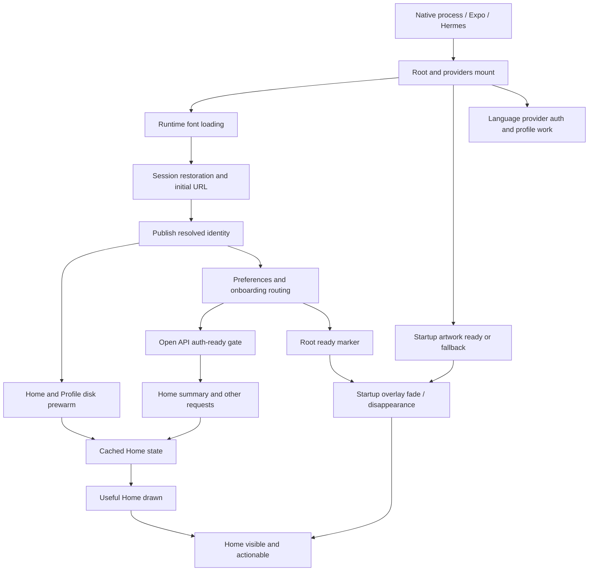

# Shoonaya performance: code audit, industry research and execution plan

Research date: 20 September 2026. Status: proposal; no application changes made for this review.

## Decision

Keep the existing cache-first architecture. First make measurement trustworthy and remove startup dependency mistakes; then reduce unnecessary work; finally tune native builds and module loading against measured traces. Do not start a cache-framework replacement, framework migration, or large endpoint rewrite from the earlier numerical score.

The implementation has useful foundations, but current evidence does not establish its real-device launch latency, rendering smoothness, energy use, or parity with a large consumer app. Some previous “all phases complete” claims describe code delivery rather than the measurement gate required by the startup plan.

## Scope and evidence limits

Native repository: `/Users/Business(C)/shoonaya-mobile`. Backend/PWA and canonical API/DTO ownership: `/Users/Business(C)/Sanatan Sangam/Shoonaya`.

Inspected startup orchestration, font/splash handling, providers, identity/session/API layers, Home coordinator and child cards, Home/Profile/Japa/Mandali/Pathshala cache implementations, all tab loaders, realtime/outbox lifecycle, telemetry recording/upload/admin aggregation, Home and Profile server routes, Metro/native release configuration and relevant tests. Searched other routes for repeated auth and heavy imports. This is an end-to-end static review of the performance architecture, not line-by-line certification of every feature or production query plan.

Both repositories had existing edits and concurrent activity during review, including telemetry additions being committed. Findings describe the inspected working-tree implementations; implementation must recheck the referenced symbols against the next frozen baseline. No production database, deployment, EAS build, phone benchmark, or store-console measurement was performed. Existing APKs are older artifacts, not proof of the reviewed source's performance.

Native validation performed with the repository's existing commands:

- `npm run typecheck`: passed, no TypeScript errors.
- `npm test`: 648 passed, 0 failed, 0 skipped, 0 cancelled; 115 suites.
- These tests establish limited functional/structural properties, not launch speed. In particular, the auth-ownership test examines selected screen files and misses providers/components.

Graph reports were consulted as required. The native graph contains substantial Pods/header noise and is dated before current changes; direct source inspection is authoritative here. Refresh the source-scoped graph as part of subsequent code delivery.

## Lessons from real large apps

| Primary engineering source | Published lesson | Application to Shoonaya |
|---|---|---|
| [Shopify App performance, 2024](https://shopify.engineering/improving-shopify-app-s-performance) | Set percentile goals; inspect cache-hit rates, viewport rendering, module initialization and hidden-screen work. | Measure the visible Home experience and child requests before adding caches. Profile a bounded first viewport and deferred cards. Their gains are not our estimates. |
| [Shopify render measurement, 2022](https://shopify.engineering/measuring-react-native-rendering-times) | A React render is not proof that native UI is visible and interactive; distinguish render passes and transitions. | Mark data-ready, visible-content and interaction separately. Validate markers using native traces and UI actions. |
| [Uber iOS measurement, 2022](https://www.uber.com/sa/en/blog/measuring-performance-for-ios-apps-at-uber-scale/) | iOS process prewarming distorted custom launch timings; combine OS measurements with carefully defined application spans. | Do not treat time since JS/root mount as tap-to-content. Separate OS launch metrics from custom spans; keep OS/device cohorts. |
| [Meta Baseline Profiles, 2025](https://engineering.fb.com/2025/10/01/android/accelerating-our-android-apps-with-baseline-profiles/) | Tune profiles to actual journeys and check memory tradeoffs; larger profiles can regress performance. | Benchmark app-specific Android startup/feed paths after checking existing dependency profiles. Avoid profiling the entire app indiscriminately. |
| [Facebook Android, 2014](https://engineering.fb.com/2014/06/19/android/improving-facebook-on-android/) | Low-end-device traces exposed too many concurrent initializations. | Background work still competes for CPU, disk and network. Schedule it by user need, not merely with `void` promises. |

Research currency matters: [Shopify's September 2026 Shop app migration](https://shopify.engineering/shop-app-migration) describes moving that app to native implementations and comparing visible home-feed startup. That is a distinct product and workload from the 2024 Shopify App study. It neither invalidates the earlier measurement lessons nor proves Shoonaya needs a rewrite. Investigate a native replacement only if measured bottlenecks survive targeted fixes and justify its cost.

## Actual startup dependency path

Some branches overlap; the diagram is dependencies, not measured duration. Child screens can mount under the overlay. The API gate is an additional dependency even when cached rendering is available.

## Findings and proposed remedies

“Confirmed” means the source path exists. It does not quantify device impact. “Experiment” means benefit remains to be demonstrated.

| ID / priority | Evidence and consequence | Proposed work and proof |
|---|---|---|
| F01 / P0 measurement | `app/_layout.tsx` calls `markInteractive()` when `readyToRender` becomes true. The artwork overlay may still be fading and Home may still be loading. The local receipt starts at root mount. | Separate root-ready from real interaction. Require the destination's usable content and overlay removal; validate against native trace/video and a successful tap. Classify emergency fallback separately. |
| F02 / P0 startup dependency | Cold start awaits `routeForSession`; missing-profile repair inside it uses `apiFetch`; that function awaits `waitForAuthReady`; the normal `markAuthReady` occurs after routing returns. The emergency timer opens the gate after six seconds. | Separate session-resolution readiness from route/profile readiness. Permit authenticated bootstrap after token resolution without bypassing authorization. Test missing profile, failed profile lookup, expired session and OAuth. Repair must not depend on the emergency timer. |
| F03 / P1 identity ownership | `lib/i18n/LanguageContext.tsx` calls `getUser`, reads `profiles.app_language`, and registers another auth listener. `components/home/SacredCalendarSheet.tsx` also registers a listener. The ownership test scans selected tab files only. | Consume centralized identity, deduplicate language reconciliation, invalidate late responses on identity/language revisions, preserve explicit language changes and remote reconciliation. Widen ownership coverage with an explicit allowlist for intentional auth infrastructure. |
| F04 / P1 serial startup work | Root's session-restore effect returns until runtime fonts load. `app.json` registers the font plugin without an explicit embedded font list; root loads several families/weights with `useFonts`. | First test font-independent auth initialization while keeping rendering font-safe. Separately test build-time font embedding with verified native family names and all supported scripts. Measure font and identity spans independently. |
| F05 / P1 misleading telemetry | Home's memory-snapshot fast path can return from `onFocus` without recording a route-open; other routes record when data is applied, before native paint. Profile has server-timing collection but no equivalent route-open instrumentation. | One route-flow owner per navigation. Record memory/disk/network/empty/error outcomes consistently. Capture initial and repeat tab visits, successful empty states, abandoned loads and failures. Do not make fastest opens disappear from the dataset. |
| F06 / P1 telemetry identity | `telemetryUpload.ts` reads an identity's summary asynchronously, then calls `apiFetch` without binding `expectedUserId`. Switching accounts during that sequence can attach the old summary to the new token. | Capture identity revision, cancel superseded uploads and bind authenticated requests to their owner. Define explicit guest behavior. Test A→B and A→logout→A, including delayed reads and 401 replay. |
| F07 / P1 telemetry aggregation | Uploads contain overlapping rolling summaries and app version/platform, without native build/OTA update ID, launch type, sample-window identity, or device/OS cohorts. Upload is background-triggered. Backend time-window counts are computed from a latest-row limit. | Add non-overlapping windows, idempotent batch IDs, build/OTA/metric-schema identity and bounded cohorts. Compute window counts across the actual time range. Use mergeable histograms or sampled observations; never average device p95s into a fleet p95. Background delivery is best effort: retry safely on a later active session and count unreported/abandoned flows. |
| F08 / P1 telemetry overhead | Each append reads/parses/writes the rolling AsyncStorage envelope. Clearing telemetry does not coordinate pending append chains. | Measure serialization/storage cost; batch bounded events after useful content or at safe lifecycle opportunities. Add clear-generation barriers so queued writes cannot restore cleared data. Preserve crash/stall evidence with a small receipt, not a full-buffer write per milestone. |
| F09 / P1 Home work outside summary | `index.tsx` uses a long ScrollView. `QuizSparkCard` starts quiz/stats/saved-response work and conditionally session/profile reads; `FestivalQuizBanner` fetches separately. Home-live, push/location/timezone and language reconciliation add work. | Inventory every request and mount before useful Home and before interaction. Defer below-viewport cards based on visibility/intent, retain stable placeholders, and avoid repeated mounts. Consider section virtualization only if traces justify it. One Home-summary request is not the total app request count. |
| F10 / P1 Profile waterfall | `profile.tsx:loadProfile` awaits progress summary, then a direct `profiles`/`kuls` lookup before constructing the final profile. Backend progress-summary owns the main DTO. | Either include the safe kul display fields in the canonical summary or paint the main profile before optional enrichment. Preserve live-only entitlement authority. Test offline/cache-hit/missing-kul behavior; eliminate the extra request or remove it from useful-content latency. |
| F11 / P1 lifecycle work | Mandali realtime subscription and seekers/connection-request effects are tied to mounted/profile state, not focus. Visited tabs may remain mounted. Generation guards stop stale UI application but do not necessarily stop requests. | Define offscreen policy: retain data; pause nonessential subscriptions/queries; mark dirty and refresh once on return. Keep durable outboxes reliable. Compare hidden-tab network, renders, CPU and return freshness. |
| F12 / P1 failure amplification | Mandali feed failure starts a direct-Supabase fallback with additional reads. Safety lookup failure currently substitutes empty exclusion sets. `resilientFetch` retries transient failures without method/idempotency classification. | Bound degraded-mode work. Prefer safe existing content/explicit failure where eligibility cannot be established. Retry reads within a deadline; retry mutations only with an idempotency guarantee. Measure attempts and failures, not only eventual success time. |
| F13 / P1 request deadlines | `apiFetch` starts its deadline after waiting for auth. Passing a caller signal disables its internally created deadline. It returns after headers, so subsequent body parsing is outside that timer. | Specify auth-wait, transport/body and total-user-flow budgets. Compose caller cancellation with deadlines and distinguish timeout/cancel/unauthorized. Do not claim that `timeoutMs` currently bounds the entire flow. Check refresh deduplication at both app and Supabase SDK layers before adding another refresh owner. |
| F14 / P1 cache consistency | Home/Profile have stronger memory/read deduplication and clear barriers. Mandali/Pathshala use simpler read/write/remove storage; Japa uses one storage slot with an owner check and clears on the guest Japa path. | Audit every sign-out/account-switch boundary, including a tab never mounted and a write racing removal. Preserve the Japa owner check; add explicit purge/lifecycle guarantees where missing. Adopt small shared invariants, not a wholesale cache replacement. Recheck language/tradition/location/content-version invalidation independently of user ID. |
| F15 / P2 tab request policy | Pathshala refreshes paths and context together on loads/focus. Bhakti has a local in-flight/TTL helper. Japa intentionally reconciles durable completion work after context loading. | Use per-surface invalidation/freshness rules, shared in-flight work where demonstrated, and separate static catalog version from private progress. Keep completion reconciliation, membership changes and manual refresh authoritative. Measure tab return requests, stale duration and network bytes. |
| F16 / P2 Tirtha location | `initialize` waits for both passport and a location chain using current GPS followed by nearby results. No current-position deadline is visible in this path. | Display the passport independently. Test an age/accuracy-qualified last-known location while requesting current position, with truthful location labeling and bounded waits. This must not supply approximate location to canonical calendar calculations. |
| F17 / P2 backend critical path | Home-summary performs auth/profile work, parallel data batches, then calendar batch metadata and published story enrichment before responding. A client request still fans out into many server queries. Timeout races provide fallbacks but do not inherently cancel underlying work. | Use existing Server-Timing and correlated traces to rank stages. Record DB/query counts, payload bytes and degraded sections. Only then split optional enrichment, improve selective queries or introduce qualified caching. Preserve every calendar eligibility/approval check. Index work requires query plans on representative safe data. |
| F18 / P2 JS initialization | Installed Expo Metro defaults contain `inlineRequires: false`; local config does not override it. Maps and YouTube are statically imported in their destination routes. Inclusion in a bundle does not prove startup evaluation. | Trace evaluated modules and native module initialization. Test inline requires independently, with side-effect-order tests. Defer expensive feature initialization only when it is on the launch path. Do not advertise native production route splitting as available. |
| F19 / P2 Android build | Release minification/resource shrinking default off; keep rules broadly preserve Expo/React/Reanimated classes. | Build a release experiment with code/resource optimization configured in both the source-of-truth prebuild config and actual native build path. Refine rules conservatively; retain mapping files and verify symbolication. Measure device-specific delivered size and startup, not universal APK size alone. |
| F20 / P2 native profiles/assets | Existing local release output contains baseline-profile artifacts, but their presence does not prove app-specific journey coverage. Startup artwork and Home hero decoding are separate from disk JSON hydration. | Inspect packaged profile contents/installation; benchmark compilation modes before generating app-specific profiles. Trace image decode, dimensions, memory and repeated tab-switch retention. Keep offline artwork and supported devices. |
| F21 / P1 test blind spots | Current tests can pass despite F02/F03 because isolated gate tests and source-pattern assertions do not execute the complete provider/startup interaction. | Add integration tests of the actual orchestration and rendered transitions, plus release-build end-to-end journeys. A regression test should fail on the old behavior and cover negative/cancellation branches. |

F02 is a code-level wait-cycle finding with a timed escape, not a claim that all users encounter a six-second launch. F11/F18/F20 need profiling to establish cost. F12's safety fallback needs correctness review even if its performance cost is small.

## Measurement contract

Use monotonic durations (`performance.now` or platform trace clocks), with UTC timestamps only for correlation. Never subtract JS and native clocks without an established clock mapping. Definitions must be versioned so a changed marker cannot masquerade as a speed improvement.

| Metric | Start → stop | Tool / interpretation |
|---|---|---|
| OS launch / TTID | Platform-defined launch → initial app frame | Android Macrobenchmark/Perfetto; iOS launch metrics/Instruments. Keep platform semantics separate. |
| Useful Home | Launch flow → visible, correctly owned Home content and working navigation, startup cover removed | Native render observation plus application readiness; lab screenshots/video and action assertions validate it. Cached, network and valid-empty outcomes are separate. |
| Interaction readiness | Navigation or launch intent → intended first action succeeds | Release UI test and trace marker; root readiness alone is insufficient. |
| Refresh completion | Revalidation begins → accepted current-identity response applied | Separate from usable-cache startup. Record calendar pending/degraded states. |
| Route return | Tab/navigation press → current destination visibly usable | Per-flow ID, source/destination, cache source, content age, success/error/abandonment. |
| Auth/cache spans | Each operation begins → completion or failure | Font load, session restore, profile gate, cache read/parse/apply, write, native render. |
| Network/backend | Gate wait, request, response/body, server stages | Endpoint template, request ID, attempt count, status, bytes, server wall time/query count. Never record tokens, query IDs, journal content or precise location. |
| Smoothness | Fixed launch/scroll/comment/reader journey | Frame-duration/jank/hitch distribution at device refresh rate; JS long tasks and native main-thread work. Average FPS hides stalls. |
| Resource cost | Fixed journey and subsequent idle period | Android PSS/native/JS memory; iOS footprint/allocations; CPU, image decode and energy signals. Compare within a platform/device, not mismatched units. |
| Reliability | All attempted flows | Success, explicit degraded/error state, timeout, abandonment, crash/ANR/hang. Report denominator; failures cannot disappear from latency charts. |

Expo Observe is already present: first verify the installed SDK 57 APIs and whether events actually reach the configured account. Use its supported markers where possible rather than adding a second overlapping SDK. The SDK 57 docs explicitly require `markInteractive` to reflect interaction readiness. [Expo Observe](https://docs.expo.dev/versions/v57.0.0/sdk/observe/)

Android TTID thresholds are excessive-start diagnostics, not product goals; first frame is different from useful content. Use `reportFullyDrawn` at the correctly defined usable state if the chosen integration supports it; verify rather than assume the Observe marker wires that platform API. [Android launch timing](https://developer.android.com/topic/performance/vitals/launch-time)

For iOS use XCTest launch measurements, Instruments App Launch/Time Profiler and MetricKit distributions. Supplement first-frame data with destination-specific readiness. Account for prewarming and resume; do not merge them with process-cold starts. [Apple launch guidance](https://developer.apple.com/documentation/xcode/reducing-your-app-s-launch-time)

### Minimum event/batch dimensions

Metric schema, app version, native build number, Git/experiment identity for lab runs, Expo runtime and OTA update ID, platform/OS, device class, launch class, route template, auth class, cache source/age bucket, network class, outcome, monotonic duration, sampling probability and batch/window identifier. Keep dimensions bounded. Record build identity at event creation, not only at upload, because persisted samples can span an update.

Use an ephemeral flow ID for correlation. There is no need to introduce a persistent guest device identifier to make idempotent upload batches. Histograms must have identical boundaries across batches; retain counts/sums and merge buckets. Percentiles computed from buckets are approximate and must be labeled. Do not merge overlapping rolling windows. Track dropped events and upload failures. Protect sign-out and account transitions before enabling wider collection.

The new backend page currently displays individual summary receipts; that is useful diagnostics, not a fleet startup distribution. Its limited recent-row query cannot support complete hourly/daily counts at scale. Fix the counts or label them explicitly as recent-sample counts.

## Benchmark matrix and reproducibility

Use an older supported physical iPhone and a low/mid-range physical Android as primary devices, plus a recent device on each platform for regressions. Select actual available models before execution; none were benchmarked in this review. Android emulator and iOS Simulator remain useful for correctness and repeatable UI assertions, not release speed claims.

| Scenario | Required checks |
|---|---|
| Cold process, populated valid cache | Exact owner, useful content, no full-screen refresh replacement, request budget |
| Cold process, empty cache | Loading hierarchy, data-ready vs visible-ready, correct first action |
| Stale/corrupt cache | Safe recovery, stale disclosure, no stale approved-date claim, bounded revalidation |
| Guest/authenticated/expired session | Separate cohorts; no unauthenticated request storm or repair wait cycle |
| Offline/constrained network | Cached content remains usable, bounded failures, no mutation replay duplication |
| Android warm and hot / iOS resume | Separate process/activity states, refresh only when policy requires |
| First tab visit and repeated returns | Data/mount counts, focus dedupe, hidden work, memory growth |
| Account switch and sign-out during work | A→B, A→logout→A, cache write/clear races, telemetry owner, language response races |
| Calendar/language/profile boundaries | Spiritual-day rollover, DST/timezone, location/tradition/language edits, content version |
| Mandali activity | Long feed/comments, keyboard after posting, realtime burst, pagination, reconnect, muted/blocked author |
| Practice/reader/media | Japa counting and outbox reconciliation, lesson completion, reader scroll, audio interruption and map entry |
| Deep link / notification entry | Destination readiness without forcing Home, back navigation, no duplicate auth/routing |
| Presentation variants | Light/dark, increased text size, reduced motion, offline artwork, missing-image fallback |

Protocol:

1. Freeze baseline and candidate source, dependencies, native build and OTA identity. Capture an installed-artifact manifest; disable changing OTA payloads during the experiment. Do not benchmark a dirty tree as a reproducible release.
2. Use release-equivalent builds without Metro/debugger. Use separate profiling runs when tooling changes overhead; corroborate with an unprofiled timing run.
3. Seed identical app data/cache and deterministic test-account fixtures. Keep auth session state explicit. Kill the process for process-cold samples; do not clear application data except for the empty-cache cohort. Label first-install separately.
4. Control OS, network latency/bandwidth/loss, server region/load, battery/power mode and thermal state. Log exclusions rather than silently removing slow runs. Alternate/randomize baseline/candidate batches to reduce drift.
5. Start with 30 runs per key cell for debugging. For release tail evaluation target at least 100 valid attempts per variant/device/key cell; add runs when confidence intervals remain wide. These are proposed sample policies, not claims of statistical certainty.
6. Report counts and p50/p75/p95 with bootstrap confidence intervals for the difference, failures/abandonments separately, and paired/cohort-matched deltas. Never pool different devices/cache states to claim a win. Sparse production cohorts remain “insufficient evidence.”
7. Store raw lab observations, trace files, screenshots, scenario version and manifests. A checked-in comparison command should regenerate tables from those observations. No hand-entered before/after numbers.
8. Run a real-network end-to-end cohort separately from a deterministic backend fixture cohort. One isolates client performance; the other captures the experience users actually receive.

Android harness: Macrobenchmark with `StartupTimingMetric` and `FrameTimingMetric`, explicit compilation/profile installation modes, traces for each slow run. Existing `.dm` files do not prove what the installed build used. [Macrobenchmark](https://developer.android.com/topic/performance/benchmarking/macrobenchmark-overview)

iOS harness: XCTest launch metric plus signposted useful-content flows and UI actions; retain Instruments traces for representative fast/median/slow launches. Historical platform metric definitions must be checked against the current OS/toolchain. [XCTest launch metric](https://developer.apple.com/documentation/xctest/xctapplicationlaunchmetric)

### Candidate product budgets

These are proposed internal goals to ratify after baseline collection, not industry guarantees or current Shoonaya results:

- Initial aspirational reference: useful cached launch p75 around 2 seconds and cached tab return p75 below 500 ms on the selected primary devices. Report p95 separately; do not promise these values on every device/network.
- First optimization milestone: at least 10% and 100 ms reduction in the targeted primary launch metric, with a confidence interval supporting improvement. Small low-risk correctness fixes need no speed claim to ship.
- Investigate a primary-cohort p95 regression exceeding both 5% and 100 ms. Treat unclear/noisy results as inconclusive; expand the sample rather than passing them.
- No account leakage, incorrect calendar eligibility, duplicated durable mutations, auth bypass, or unannounced loss of offline functionality. These are hard gates.
- No reproducible crash/hang/ANR regression in lab journeys; production stability and energy need a sufficiently sized observation window.
- One Home summary request/read per defined initial identity flow, except separately reported bounded retries or explicit refresh. Other feature requests have their own declared budgets; the total startup count must also be reported.
- No unexplained growth in retained memory or hidden-tab work over repeated loops. Set numerical resource budgets from the baseline and device limits.

## Ordered execution backlog

Each row is a separately reviewable change/experiment; do not combine all optimizations into one build and guess which helped. S/M/L are relative engineering scope, not delivery promises.

| Step | Deliverable / owner | Scope | Exit evidence |
|---|---|---|---|
| 0A | Frozen baseline, event definitions, installed build manifest / Native + QA | M | Reproducible baseline runs and destination readiness definitions; existing receipt dashboard explicitly labeled |
| 0B | Correct readiness markers, telemetry owner binding, build/window metadata, aggregation contract / Native + backend | M | Delayed-content tests cannot report success early; account-switch upload tests; repeat batch counted once; mergeable distribution verified against a known dataset |
| 1A | Remove bootstrap wait cycle and separate session/profile/font readiness / Native | M | Missing-profile launch completes or produces a bounded explicit error without emergency timer dependency; OAuth/onboarding/deep links pass |
| 1B | Provider/component auth consolidation, guarded language reconciliation / Native | M | One intended auth owner; no redundant language auth request; remote language changes preserved; stale replies rejected |
| 1C | Font embedding experiment and artwork transition measurement / Native build | M | Correct fonts/scripts/styles both platforms; measured font/auth overlap benefit; reduced motion and image failure preserved |
| 2A | First-viewport Home scheduling and child request policy / Native | M–L | Lower pre-interaction requests/mounts/main-thread time and improved useful-content distribution; no large layout shift or delayed first scroll |
| 2B | Profile kul waterfall removal / canonical backend DTO + Native | S–M | Useful profile independent of secondary lookup or one consolidated response; cached entitlements still never authoritative |
| 2C | Focus/realtime policy, safe Mandali degraded path, deadline/retry rules / Native + backend where idempotency needed | M | Rapid tab tests, bounded outage traffic, no safety-filter bypass, no duplicate writes, fresh return behavior |
| 2D | Cache lifecycle contract audit / Native | M | Pending-write purge tests, owner switches, spiritual-date/version changes, offline rendering. Reuse existing helpers where possible |
| 3A | Backend trace/query/payload review / backend | M | Slow-stage distribution and representative query plans; subsequent optimization reduces critical-path wall time without losing content/governance |
| 3B | Tirtha progressive location and secondary-screen auth cleanup / Native | M | Passport usable without GPS delay; stale-location labeling and location accuracy policy tested |
| 4A | R8/resource shrinking and keep-rule experiment / Android build | M | Smaller delivered artifact, complete release smoke suite, recovered crash stack, device startup/memory comparison |
| 4B | Inline-require / feature initialization experiment / Native build | M | Effective Metro options recorded; evaluated-module trace improves; side-effect initialization and first-use paths pass |
| 4C | App-specific Baseline/Startup Profiles / Android | M | Packaged and installed profiles verified; compilation-mode comparison; bounded profile/memory footprint |
| 5 | Automated regression harness and staged release comparison / Native + backend + QA | M | CI correctness checks, scheduled physical runs when infrastructure exists, cohort dashboard and rollback thresholds |

Begin 0A/0B, then 1A/1B. Use the resulting trace to decide whether 1C, 2A or backend work is the next highest-value experiment. Native-build work can follow once the baseline is stable; it must still be measured separately.

No new paid observability platform is necessary to define or run the first lab baseline. Reuse Expo Observe if available, current server timing, platform profilers and the existing admin infrastructure. Production dashboards, migrations and releases follow the normal scoped review and deployment process.

## Work deliberately deferred

- Replacing AsyncStorage with MMKV/SQLite merely because another app uses it. First measure read/parse/write cost and cache volume; change only with migration, purge and encryption/privacy requirements defined.
- Enabling every lazy-loading or freezing flag at once. Measure side effects, realtime recovery, player lifecycle and first-use latency.
- Replacing all screens with FlashList. Mandali already uses it; Home is a targeted candidate, not a blanket rewrite.
- Caching authorization/entitlements or bypassing calendar/source approval for speed.
- Turning off supported ABIs or deleting offline assets to make a universal APK smaller. Compare delivered AAB/device size and product requirements.
- Treating all Supabase `getSession()` calls as remote network requests. It normally reads local state but can refresh an expired session; ownership checks are sometimes intentional. [Supabase getSession](https://supabase.com/docs/reference/javascript/auth-getsession)
- Treating JS module deferral as native production code splitting. Hermes bytecode and initialization work differ; Expo async-route production limitations must be respected. [Expo async routes](https://docs.expo.dev/router/web/async-routes/), [RN loading optimization](https://reactnative.dev/docs/0.86/optimizing-javascript-loading)

Font/build experiments must use the SDK 57 configuration contract, preserving native names and reproducible prebuild output. [Expo Font](https://docs.expo.dev/versions/v57.0.0/sdk/font/), [Expo BuildProperties](https://docs.expo.dev/versions/v57.0.0/sdk/build-properties/). R8 benefits depend on optimization scope and keep rules. [Android R8](https://developer.android.com/topic/performance/app-optimization/enable-app-optimization)

## Review coverage sign-off

| Review invariant | Result for this research |
|---|---|
| Cardinality | Finding: receipt windows overlap and recent-row cap cannot represent all hourly/daily events. |
| Detection capability | Finding: selected-file regex tests miss provider auth duplication; no physical measurement proof. |
| Both directions | Required matrix covers ready/error/cancel, account switches, and rejected stale replies. Not yet executed on devices. |
| Detection vs behavior | Finding: root readiness is recorded as interaction readiness; watchdog success can conceal degraded startup. |
| Boundary inputs | Explicit empty/corrupt/stale caches, expired auth, offline, missing profile, date/timezone and deep-link cases. Runtime evidence pending. |
| Units and frames | Proposed monotonic spans, OS metric separation, native/JS clock mapping, build/OTA attribution and platform memory units. |
| Compensation | Finding: emergency timer breaks a startup dependency cycle; fix the dependency before shortening/removing the timer. |
| Reproducibility | Existing test commands rerun; performance comparison harness/raw device data still pending. No performance numbers invented. |
| Scope honesty | Documentation only. Existing unrelated source/staged changes preserved. No commit/push/deploy or production writes performed. |
| Cross-component consistency | Backend owns API/telemetry contracts; compare Native markers and server stages with versioned definitions. No calendar calculation changed. |

The next implementation deliverable should include: frozen baseline metadata, corrected readiness/telemetry definitions, the two startup/auth dependency fixes, and a repeatable physical-device measurement report. Only that report should label an optimization as a demonstrated performance improvement.
